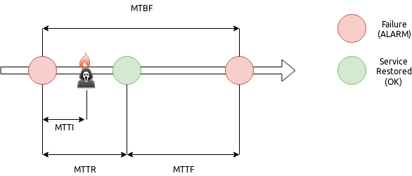
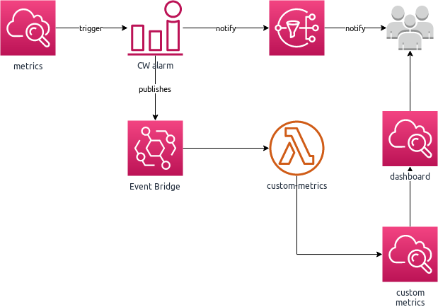
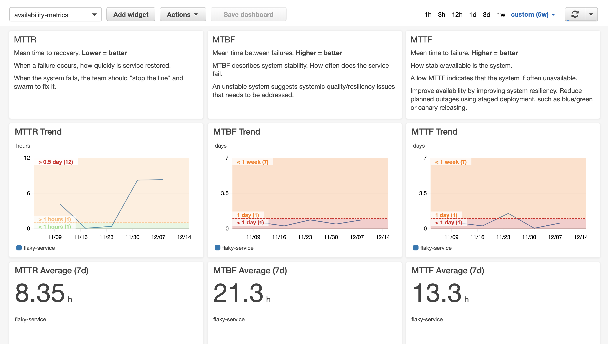

# lambda-metrics

*NOTE*: This repository is not maintained.  Use for reference purposes only.

Common metrics for monitoring operational health are **MTTR** (Mean Time To Recovery), **MTTF** (Mean Time To Failure), **MTBF** (Mean Time Between Failure).



*  MTBF - Mean Time Between Failure - How stable is my stuff?
*  MTTI - Mean Time To Identification - How long does it take to realise my application is on fire?
*  MTTR - Mean Time To Recovery - How long to put out the fires?
*  MTTF - Mean Time To Failure - What's my uptime like?

But how do you identify your services and generate the metrics?  One way in AWS is to use Cloud Watch Alarms.  If something is worth alerting on, it is worth capturing metrics.  The configuration of your Cloud Watch Alarms also captures logic for when you consider a failure to have occurred: an isolated error may not be considered a failure - but a few in succession indicates a problem.

This implementation uses CloudWatch Alarms history to calculate metrics.  The information contained within the history provides the context requried to calcaulate MTTR, MTTF and MTBF.

This implementation is limited to the [14 day retention](https://aws.amazon.com/cloudwatch/faqs/) period for CloudWatch Alarms. For a longer retention period, CloudWatch Alarms History would need to be stored separately, e.g. DynamoDB

Another important metric is MTTI (Mean Time To Identification).  Depending on your definition, you could consider the triggering of the alarm to form the boundary for MTTI - the point where the failure was identified.  However, this would invalidate the definition of the other failure metrics.  A better definition for MTTI is the time from when a failure occurs to analysing the failure and understanding the root cause (and therefore the required remediation).  Since this metric is often dependent upon human analysis and context, it cannot be calculated automatically.

# WHAT



This project uses Cloud Watch Alarms, which sends notifications to Event Bridge, to trigger lambda functions to calculate, and publish, custom CloudWatch Metrics for the alarm.

Metrics are generated under the namespace `Operations`, named for the metric, e.g. `MTTF`, `MTTR`.  A metric dimension `service` is generated based on the alarm name.



### Permission Boundaries
This project creates Lambda functions, with associated roles.  In your environment, you may wish to apply a permission boundary to all roles created.

The optional parameter `PermissionsBoundary` allows you to provide the ARN of an exising IAM Policy you have created to apply to all roles as a permission boundary.

**NOTE:** for successful deployment, the permission boundary must, at a minimum, allow the permissions required for this solution:
```
Version: 2012-10-17
        Statement:
          - Effect: Allow
            Action: cloudwatch:DescribeAlarmHistory
            Resource: '*'
          - Effect: Allow
            Action: codepipeline:ListPipelines
            Resource: '*'
          - Effect: Allow
            Action: cloudwatch:PutMetric
            Resource: '*'
          - Effect: Allow
            Action:
             - dynamodb:GetRecords
             - dynamodb:GetShardIterator
             - dynamodb:DescribeStream
             - dynamodb:ListStreams
            Resource: '*'

```

## Adding to your project

This project does not define the alarms you wish to monitor, but provides the framework for notifying on those metrics.

Given your alarm configuration:
```
FlakyServiceAlarm:
      Type: AWS::CloudWatch::Alarm
      Properties:
        AlarmName: flaky-service
        AlarmDescription: Example alarm for a flaky service - demonstrate capturing metrics based on alarms.
        # The metric to alarm on
        Namespace: "AWS/Lambda"
        MetricName: "Errors"
        Dimensions:
          - Name: "FunctionName"
            Value: "${self:custom.flakyFunctionName}"

        # What to measure
        Statistic: "Sum"
        Period: 60
        Unit: Seconds

        # When to alarm
        TreatMissingData: "missing"
        ComparisonOperator: GreaterThanThreshold
        DatapointsToAlarm: 1
        EvaluationPeriods: 1
        Threshold: 0.0

        # Generate Ops Metrics for state transitions
        ActionsEnabled: true
        AlarmActions:
          - "${self:custom.opsMetricsTopicArn}"
        OKActions:
          - "${self:custom.opsMetricsTopicArn}"
```

Adding in the integration to notification is enabled using the snippet:
```
        # Generate Ops Metrics for state transitions
        ActionsEnabled: true
        AlarmActions:
          - "${self:custom.opsMetricsTopicArn}"
        OKActions:
          - "${self:custom.opsMetricsTopicArn}"
```

Where `"${self:custom.opsMetricsTopicArn}"` is the topic ARN for the metrics notifications.

This can be calculated as: `arn:aws:sns:#{AWS::Region}:#{AWS::AccountId}:lambda-ops-metrics`

The value can also be imported using the export name: `#{AWS::StackName}-metric-topic-arn`

Where `#{AWS::StackName}` is the name of the deployed metric stack - e.g. `lambda-ops-metrics-dev`
```
!ImportValue lambda-ops-metrics-dev-metric-topic-arn
```

# Setup

Ensure you have AWS credentials configured in `~/.aws/credentials`.  If you use `AWS_PROFILE`, please note that Serverless Framework requires these profiles to be configured in `~/.aws/credentials` also, rather than `~/.aws/config`

To use the included docker development environment
```
docker-compose run --rm dev-env
```

To build and deploy the service:
```
npm install
npm run deploy:dev
```

## Running the Example
This project also includes an example of usage containing:

* A _flaky_ lambda function, that randomly fails on execution (configured to 10% of the time)
* A CloudWatch alarm for the above function, configured to alarm on any failures and send notifications to the lambda metrics service

Ensure you have deployed the `lambda-ops-metrics` service before installing the example.
Deploy the example into the same region as `lambda-ops-metrics`

```
cd example
npm install
npm run deploy:dev
```

To run the lambda, with a random chance of failure:
```
npm run test
```

To run the lambda, ensuring a failure:
```
npm run test:failure
```
